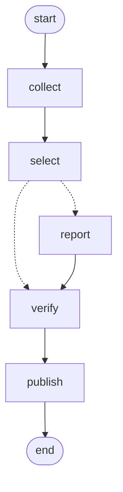

# nk-briefing

- **무엇**: 북한 뉴스 브리핑 에이전트
- **출발점**: 모두의연구소 캠프 136 뉴스레터 에이전트 과정(수집→선별→취재→검수→발행)을 북한 뉴스 소스에 적용한 것
- **과제 보고서**: [REPORT.md](REPORT.md)
- **진행 상황·소스 편성·남은 일**: [HANDOFF-nk-news-briefing.md](HANDOFF-nk-news-briefing.md) 참고

## 구조

| 파일 | 하는 일 |
|---|---|
| `graph.py` | LangGraph 한 판. 수집 → 선별 → 취재(기사마다 워커) → 검수 → 발행, 끝나면 `store/metrics.jsonl`에 한 줄 |
| `audience.yaml` | 북한 브리핑의 내용 전부: 독자·중요도 기준·버릴 것·토픽별 데스크지침·소스·기자역할·발행 제목·1차칸. 편집 방향과 소스는 여기만 고친다 |
| `briefing_cfg.py` | 브리핑 yaml의 모양 검사. 칸이 빠졌거나 오타면 실행 전에 멈춘다 |
| `run.py` | 한 번 실행. GitHub Actions가 05:43(KST)에 깨워 07:30까지 기다린 뒤 돌린다. 08:13 예비 실행은 그날 이미 보냈으면 건너뛴다 |
| `scorecard.py` | 쌓인 기록으로 소스별 기여·깔때기·경보 누적을 본다 |
| `collect_nk.py` · `min_publish.py` · `tier1_mou.py` | 수집 노드가 쓰는 부품 (피드 수집·원장·통일부 1차枠). 소스 목록은 yaml에서 읽고, `피드본문: true`인 소스는 피드 본문도 챙긴다 |
| `grounding.py` | 검수 노드가 쓰는 숫자 원문 대조 (값 없음·한정어 빠짐·추정 표현 빠짐) |
| `.env.example` | 로컬 키 파일 틀. `.env`로 복사해 채운다 |
| `requirements.txt` · `requirements-dev.txt` | 버전을 고정한 실행 의존성 · 그래프용 matplotlib |



- **다시 뽑는 법**: `python -c "import graph; print(graph.build().compile().get_graph().draw_mermaid())"`로 다시 뽑는다
- **점선은 조건부 엣지다**
  - 고른 기사가 있으면 기사마다 `report` 워커가 펼쳐진다
  - 0건이면 `verify`로 바로 가서 발행까지 간다

### 브리핑 칸

- **속보**: 연합·DailyNK·RFA 한국어·데일리NK재팬, 24h 창, 모자라면 48h·72h, 소스당 3건
- **심층**: 38North·아시아프레스, 7일 창, 최대 1건
- **1차**: 통일부 북한동향, 요약 300자 이상인 날만, 최대 1건

### 카드 수

- 하루 카드는 **3장**이다
- 심층이나 1차가 있으면 3장 중 1장을 그것이 차지하고, 둘 다 있는 날만 4장이다
- 속보는 예비까지 4건을 취재해 두고, 검수 뒤에 칸 수만큼 선별 순위대로 싣는다
- 안 실린 예비는 원장에 안 올라 내일 후보로 남는다

## 시작하기

```
git clone https://github.com/tigermorning/nk-briefing.git
cd nk-briefing
python -m venv .venv
.venv\Scripts\activate            # macOS·Linux: source .venv/bin/activate
pip install -r requirements.txt     # 버전 고정. 그래프까지 보려면 requirements-dev.txt
copy .env.example .env              # macOS·Linux: cp .env.example .env, 키 값 채우기
python test_graph_fake.py           # 키 없이 먼저 확인
python run.py                       # 키가 있으면 끝까지 dry-run (DRY_RUN 기본 1)
```

- 키가 없으면 `run.py`는 네트워크를 쓰기 전에 안내 문구와 함께 종료 코드 2로 멈춘다
- Python 3.12에서 확인했다

## 실행

**키·네트워크 없이 도는 테스트** (저장소 파일을 바꾸지 않는다)

```
python test_graph_fake.py    # 모델·네트워크를 가짜로 바꿔 그래프 경로 21개 시나리오
python test_golden_nk.py     # 같은 가짜 입력에서 프롬프트·수집·디스코드 payload·로그·원장이 golden/nk_p1.json과 같은지
python test_grounding.py     # 값 기준 숫자 대조·한정어·추정 표현 검사
python test_schedule.py      # 07:30 대기 계산, 하루 한 번 발송 판정, 실행 전 키 점검
python test_config.py        # audience.yaml 오타(소스·칸·1차칸 포함)가 시작 시점에 잡히는지
```

**파이프라인과 성적표**

```
python run.py                # 실제 수집·모델 호출. DRY_RUN 기본 1이라 디스코드로 안 보낸다
python scorecard.py          # 성적표 (--plot out.png 는 requirements-dev.txt 필요)
```

**측정 스크립트** (네트워크를 쓰고, 대부분 `store/metrics.jsonl`에 측정 행을 덧붙인다. 이름이 `test_`여도 단위 테스트가 아니다)

```
python probe_sources.py      # 외국 후보 21곳 + 핵심 3곳 측정 (키 필요. 판정 오류가 있으면 probe_sources.json 대신 .partial.json)
python exp/step12_exaggeration.py  # 실제 카드에 과장을 심어 옛 검수와 새 검수 비교 (키 필요)
python collect_nk.py 72      # 수집만, 72시간 창. --save-seen 을 붙일 때만 store/last_seen.json 갱신
python test_number_check.py  # 강의식 문자열 숫자 대조가 북한 원문에서 틀리는 사례 (1/5, 원문이 바뀌면 assert로 멈춤)
python test_g1.py            # G1 원문추출 게이트
python test_g23.py           # G2 14일 집계 + G3 robots.txt
python test_guards.py        # 조용한 실패 가드 3종 발화 재현
```

- `exp/step6~9` 실험 입력 중 기사 본문(`exp/bodies.json`)은 저작권 때문에 저장소에서 뺐다
  - `exp/inputs.py`가 그때그때 피드에서 다시 만들므로, 9/14와 같은 입력으로는 재현되지 않는다

### 키와 발행

- **로컬 키**: 이 저장소의 `.env`에서 읽는다(`.env.example` 참고)
  - 다른 `.env`를 쓰려면 `NK_ENV_FILE`로 경로를 지정한다. `graph.py`와 `mou_api.py` 둘 다 따른다
- **Actions 키**: 저장소 Secrets `OPENAI_API_KEY` · `DATA_GO_KR_KEY` · `DISCORD_WEBHOOK_URL`을 쓴다
- **실제 발행**: `DRY_RUN=0`일 때만 한다
- **발행 원장**: `store/published.json`은 실제로 보낸 뒤에만 쓴다
- **메트릭 위치**: 어느 폴더에서 실행해도 이 저장소의 `store/metrics.jsonl` 한 곳에 쌓인다
- **Actions 기록 커밋**: 실패로 끝난 실행도 `store/`를 커밋한다. 카드를 보낸 뒤 실패로 끝나도 원장이 남아야 08:13 예비 실행이 같은 카드를 다시 보내지 않는다
- **손으로 돌리지 말 시간**: 05:40~08:30 KST. 대기 중인 예약 실행과 겹치면 08:13 예비 실행이 대기열에서 밀려날 수 있다

## 이 저장소가 지키는 규칙

- **빈 결과를 사실로 읽지 않는다**
  - 라이브러리가 돌려준 `0`/`False`/`None`은 "없음"일 수도 "못 받음"일 수도 있다
  - HTTP 상태코드를 같이 남겨 둘을 가른다
  - `urllib.robotparser`와 `trafilatura.fetch_url()`이 각각 한 번씩 이걸로 오판을 만들었다
- **결과를 바꾸는 건너뜀만 기록한다**
  - 소스 하나가 통째로 빠지는 건 `dead`에 이유와 함께 남긴다
  - 항목 한 건이 시간창 밖이라 빠지는 건 소스별 합계로만 센다
  - 전부 적으면 진짜 신호가 노이즈에 묻힌다
- **`store/metrics.jsonl`은 고치지 않는다**
  - 앞쪽 두 행에는 나중에 오판으로 밝혀진 값이 들어 있다
  - 그대로 두는 게 "언제 무엇을 잘못 알았는지"의 기록이다
- **숫자는 값으로 원문과 맞춘다**
  - 헤드라인·요약·💡 문장의 숫자가 원문에 없거나, 원문의 `최대`·`추정`이 빠지면 검수에서 떨어진다(`grounding.py`)
  - 모델 검수는 `100억 → 1,000억 달러`를 6번 모두 통과시켰다
  - 떨어진 카드는 지적 사항을 보여 주고 한 번 다시 쓰게 한다
  - 그래도 틀리면 빼고 예비 기사로 채운다
- **Cloudflare 챌린지는 우회하지 않는다**
  - 피드 전체가 막히면 `NK_SKIP_SOURCES`로 끈다 (데일리NK재팬)
  - 기사 페이지만 막히고 피드에 전문이 있으면 피드 본문으로 대신한다 (38North)
    - 순서: 원문 페이지 먼저 → 막혔을 때(401·403·429·5xx·연결 오류)나 추출 600자 미만일 때만 피드 본문
    - 404·410은 대체하지 않는다: 기사가 내려간 것이라 피드 사본을 실으면 안 된다
    - 피드 본문도 600자 미만이거나 발췌문 모양(`...`·`[…]`·`Continue reading` 끝, 발췌 요약의 3배 미만)이면 쓰지 않고 두 이유를 함께 로그에 남긴다
  - 어느 쪽을 썼는지 남긴다
    - 취재 로그: `피드 본문 사용 (페이지 HTTPError 403 cf-challenge)` 또는 `원문 페이지`
    - `store/metrics.jsonl` 행: `body_via` (`page`·`feed`·`api`·`refused` 건수)
    - 수집 로그 `NOFEED`: 전문 피드가 발췌문으로 바뀌면 페이지가 막히기 전에 알린다
  - 새 소스에 `피드본문: true`를 켜기 전에 피드 본문이 발췌문이 아닌지 재볼 것
- **프롬프트 부탁은 코드로 확인한다**
  - 같은 사건 거르기는 모델이 붙인 라벨만 믿지 않는다
  - 뽑힌 짧은 목록을 한 번 더 나란히 놓고 묶게 한 뒤 예비 후보로 채운다
- **키는 저장소 밖에 둔다**
  - `DATA_GO_KR_KEY`는 별도 `.env`에서 읽는다
  - 값을 출력하지 않는다(길이만 확인)
