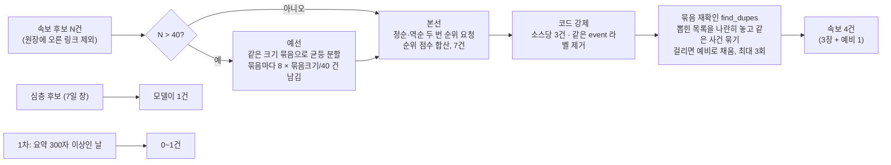
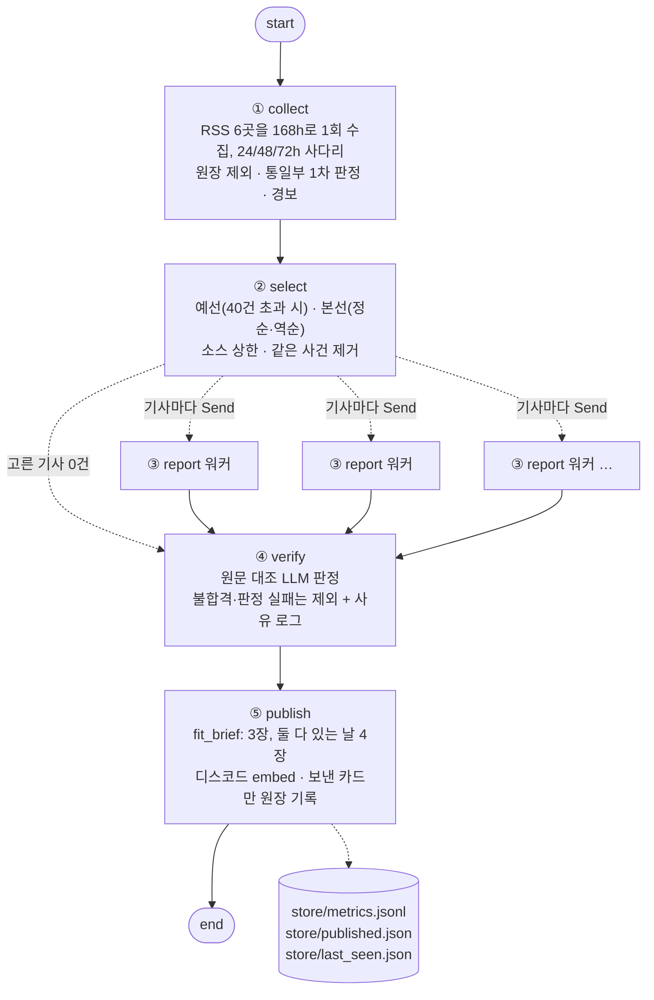
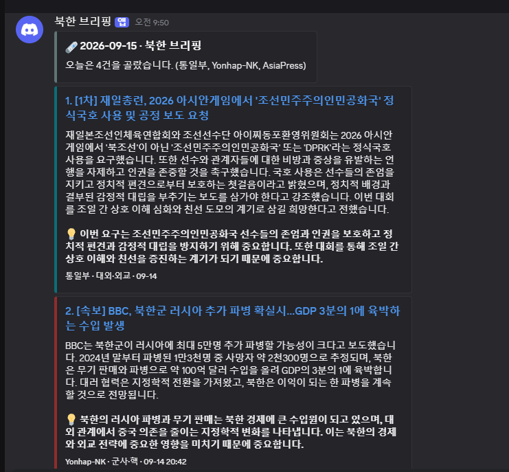

# REPORT — 북한 뉴스 브리핑 에이전트

모두의연구소 캠프 136 「나만의 뉴스레터 에이전트 구축하기」 제출 보고서.

- **저장소**: https://github.com/tigermorning/nk-briefing
- **발행 채널**: 디스코드 웹훅 (embed 카드)
- **주기**: 매일 07:30 KST 발송. GitHub Actions가 05:43에 깨워 07:30까지 기다리고, 08:13 예비 실행은 그날 이미 보냈으면 건너뛴다
- **모델**: `gpt-4.1-mini`, temperature 0, 모든 호출 구조화 출력(pydantic)
- **과제 제외 소스 6곳**(OpenAI·DeepMind·TechCrunch·The Verge·MIT TR·AI타임스)은 주제가 달라 후보에도 넣지 않았다.

| 필수 단계 | 구현 위치 | 이 보고서 |
|---|---|---|
| 1. 자료 수집 (3곳 이상, 채택·탈락 근거) | `graph.collect` · `collect_nk.py` · `tier1_mou.py` | 2장 |
| 2. 자료 선별 (3~5건, 기준과 근거 로그) | `graph.select` · `audience.yaml` | 3장 |
| 3. 요약 및 인사이트 | `graph.report` | 4.2 |
| 4. 자동 검수 및 예외 처리 | `grounding.py` · `graph.verify` · `graph.fit_brief` | 4.3 |
| 5. 최종 발행 | `graph.publish` · `.github/workflows/daily.yml` | 5장 |

---

## 1. 분야 및 독자 정의

### 왜 북한 뉴스인가

- **매일 새 일이 생기고, 틀리면 비용이 크다.** 미사일 발사·인사·제재 소식이 거의 매일 나오지만, 같은 사건을 여러 매체가 옮기고 북한 매체의 주장이 사실처럼 섞인다. 요약 자체보다 **중복 제거·출처 구분·검수**가 가치를 만드는 분야라서, 과제의 선별·검수 단계를 제대로 시험할 수 있다.
- **소스 성격이 다양하다.** 국내 통신사(속보), 북한 내부 소식통 매체(DailyNK·RFA), 해외 연구소(38North, 주간 장문), 정부 1차 자료(통일부 API)가 섞여 있어 "양이 나오는가·본문이 뽑히는가"를 소스마다 따로 재야 했다.
- **외국어 소스가 새 사건을 준다.** 데일리NK재팬(일본어)은 한국어 매체가 안 다룬 기사를 냈다(2장 측정). 일본어 원문을 한국어로 요약하는 문제가 자연스럽게 따라왔다.

### 독자 페르소나

`audience.yaml`의 `독자` 칸이 선별·요약 프롬프트에 그대로 들어간다.

| 항목 | 내용 |
|---|---|
| 누구 | 북한 소식을 매일 챙겨 보지만 여러 매체를 돌 시간은 없는 한국어 독자 |
| 이미 아는 것 | 남북관계 기본 구도, 김정은 체제, 대북제재가 있다는 사실 |
| 원하는 것 | 아침 출근길에 "오늘 실제로 일어난 일" 몇 건. 전망·추측·의례 보도는 필요 없음 |
| 분량 | **하루 3장.** 심층이나 1차 자료가 있으면 3장 중 1장을 차지하고, 둘 다 있는 날만 4장 |

분량 규칙은 첫 실발행(6장)을 디스코드에서 직접 본 뒤 정했다. 6장은 많았고, 3번째 카드가 날씨·여가 스케치 기사였다.

---

## 2. 소스 채택표

### 2.1 측정 관문

소스마다 아래 관문을 코드로 쟀다(`test_g1*.py`, `test_g2*.py`, `test_g23.py`, `probe_sources.py`).

| 관문 | 묻는 것 | 기준 |
|---|---|---|
| **G1** 본문 | `trafilatura`로 원문 본문을 실제로 뽑을 수 있나 | 본문 600자 이상 (1차 자료는 300자) |
| **G2** 양 | 칸을 채울 만큼 글이 나오나 | 일간 칸: 14일 7건 이상 / 주간 칸: 14일 1건 이상 |
| **G3** 허용 | robots.txt가 수집을 허용하나 | 허용 |
| **새 사건** | 72시간 북한 기사가 핵심 3곳(연합·DailyNK·RFA 한국어) 96시간 제목 59건에 없는 사건인가 | 모델 판정, 1건 이상 |

길이 기준만으로는 속았다. 아래 탈락 사유 중 여럿이 "관문은 통과했는데 쓸 수 없는" 경우다. 그래서 G1에 두 신호를 더했다.

- **티저 판별**: 표본 본문 길이의 편차(최장/최단)가 작고, **그리고** 문장이 중간에 끊겼으면 유료벽 티저로 본다. 진짜 본문은 길이가 널뛰고(38North 2,940~19,989자), 티저는 고르다(NK News 1.2배).
- **증가분**: 상세페이지 본문 길이에서 피드 요약 길이를 뺀 값. 0에 가까우면 가져와도 새 글자가 없다.

### 2.2 채택 (7곳)

측정 시각: G2는 2026-09-14, 새 사건·본문 표본은 2026-09-14 09:37 UTC(`probe_sources.json`).

| 소스 | 언어 | 칸 | 14일 건수 | 24h / 7일 | 본문 표본(자) | 새 사건 | 채택 근거 |
|---|---|---|---|---|---|---|---|
| 통일부 북한동향 API | ko | 1차 | 30일 73건 | 평일만, 1영업일 지연 | 원문 없음 (요약만) | — | 노동신문·조선중앙통신 논조 요약이라 RSS와 겹치지 않음. 상세페이지는 73건 전부 요약 + 장식 300~338자라 증가분이 0. 그래서 **요약이 300자 이상인 날만** 칸을 연다(30일 시뮬레이션: 평일 21일 중 15일) |
| 연합뉴스 북한 | ko | 속보 | 89 | 11 / 89 | 1,430 · 426 · 1,306 | 기준 소스 | 양이 가장 많고 G1·G2·G3 통과. 대신 **쏠림**(72h 44건 중 32건)이 있어 소스당 3건 상한 |
| DailyNK | ko | 속보 | 10 | 5 / 10 | 1,522 · 1,457 · 1,443 | 기준 소스 | 북한 내부 물가·통제 소식. 피드 10건이 78.9시간치이고 가장 바쁜 24시간이 6건이라 하루 1회 수집으로 넘치지 않음 |
| RFA 한국어 | ko | 속보 | 27 | 2 / 12 | 1,537 · 2,360 · 1,363 | 기준 소스 | G1 3/3. 기여는 낮음(실행 15회 중 2회 선별). 강등 여부 관찰 중 |
| 데일리NK재팬 | ja | 속보 | — | 2 / 18 | 704 · 516 · 900 | **3/4** | 외국 후보 21곳 중 새 사건을 가장 많이 줌. 추측 기사(지도자 체중설)가 섞여 `버릴_것`에 한 줄 추가. Actions 러너에서는 Cloudflare 403이라 로컬 실행에서만 켬 |
| 38North | en | 심층 | 6 | 0 / 1 | 2,940 · 18,801 · 19,989 | — | 일간 기준 FAIL, 주간 기준 PASS. 속보와 경쟁시키지 않고 7일 창 심층 칸 1건 |
| 아시아프레스 | ja | 심층 | — | 0 / 3 | 1,258 · 1,521 · 1,179 | — | 북한 내부 물가 조사 연재. 주간 연재라 72h 새 사건 0은 정상. 7일 3건 중 1건은 북한 키워드 필터로 제외 |

### 2.3 탈락 (17곳)

| 소스 | 언어 | 측정 | 탈락 근거 |
|---|---|---|---|
| NK News | en | 14일 46건, 새 사건 2/5, 본문 1,279 · 1,188 · 1,008 | **유료벽 티저.** 600자 기준은 5/5 통과했지만 길이 편차 1.2배에 문장이 중간에 끊김. 추출 본문이 기사 대신 `About the Author…` |
| 연합뉴스 일문 북한 | ja | 14일 16건 (G2 통과) | 한국어판 번역이라 새 사건 0. G2는 번역 중복을 못 본다 |
| DailyNK 영문 | en | HTTP 200, 0건 | 빈 피드. 응답이 정상이라 코드에서 오류로 승격해 잡음 |
| 중국신문망 국제 | zh | 종합 30건 중 북한 1건 | 양 부족. 그 1건도 조선중앙통신 재인용이고 연합이 이미 보도 |
| 시나 국제 | zh | 최신 글 69,913시간 전 | 2018년에 멈춘 죽은 피드 |
| NHK 국제 | ja | 139건 중 북한 7건, 새 사건 0/3 | 전부 국내 매체 기보도 |
| TASS 영문 | en | 69건 중 북한 2건, 새 사건 0/2 | 조선중앙통신 인용 + 기보도 |
| 로시스카야가제타 | ru | 100건 중 북한 2건, 새 사건 1/2 | 본문 요청이 HTTP 401. 요약할 원문이 없음 |
| 보스토크투데이 | ru | 66건 중 북한 1건, 최신 북한 기사 148.7시간 전 | 양 부족 |
| RFA 영문 | en | 최신 글 230시간 전 | 갱신 멈춤 |
| CSIS 비욘드 패럴렐 | en | 최신 글 617시간 전 (26일) | 주간 칸 기준(14일 1건)도 미달 |
| 신화망 세계 · TASS 러시아어 · 인테르팍스 · RIA 노보스티 · 레그눔 · 이스트러시아 · VOA 영문 · 발다이클럽 · IDE-JETRO | zh·ru·en·ja | 72시간 북한 기사 0건 (9곳) | 양 없음 |

**미확보**: VOA 한국어. RSS 목록 페이지가 JavaScript로 그려져 직접 피드 주소를 찾지 못했다.

---

## 3. 선별 로직 설계

### 3.1 중요도 판단 문장

`audience.yaml`에 두고 선별 프롬프트에 그대로 넣는다. 원칙은 **기사 하나를 보고 예/아니오로 답할 수 있는 질문**이다. "의미 있는 소식" 같은 인상 대신 실제로 일어난 일을 묻는다. 위에 있을수록 우선이다.

1. 미사일 발사·핵시설 가동·병력 이동 같은 북한의 군사 행동이 실제로 있었나
2. 북한 지도부의 인사·정책 결정이나 대외 노선 변화가 공식 발표로 확인됐나
3. 한국·미국·중국·러시아·일본 정부가 북한 관련 조치(제재·회담·합의)를 실제로 발표했나
4. 북한 내부의 물가·식량·통제 상황이 현지 소식통이나 조사로 새로 확인됐나

**버릴 것** (기준에 억지로 끼워 맞춰지는 기사를 막는 목록)

- 조선중앙통신·노동신문 보도를 옮기기만 하고 한국·외국 쪽 확인이나 새 사실이 없는 기사
- 친선국 축전·기념일 행사·참배처럼 해마다 같은 날 반복되는 의례 보도
- 전문가 전망·가능성 분석만 있고 새로 일어난 일이 없는 기사
- 지도자 일가의 체중·외모·건강·자녀 존재에 대한 추측 기사
- 날씨·계절·여가·거리 풍경처럼 분위기만 전하고 물가·식량·통제의 새 변화가 없는 스케치 기사

마지막 줄은 실패에서 나왔다. 첫 실발행에 공원 스케치 기사가 실려서, 모델에게 "해당하는 기준 번호를 대라, 없으면 0"을 시켜 봤다. 2회 모두 기준 4(내부 상황)를 댔다. **모델은 자기가 고른 기사를 "해당 없음"이라 하지 않았다.** 번호 관문은 빼고 버릴 것에 그 유형을 적었더니, 그 기사는 후보에도 오르지 않았다.

### 3.2 예선/본선 2단계 구조



| 단계 | 하는 일 | 왜 |
|---|---|---|
| 예선 | 후보가 40건을 넘을 때만. 44건이면 22건×2묶음, 묶음마다 4건 | 한 화면에 너무 긴 목록을 넣지 않기 위해 |
| 본선 | 같은 목록을 정순·역순으로 두 번 묻고 순위 점수(1위 n점 … n위 1점)를 합산 | **한 화면 순위는 목록 순서에 흔들렸다.** 같은 12건을 정순·역순으로 주면 상위 5건 겹침 3/5, 같은 순위 0/5 (`exp/step6.log`) |
| 소스당 3건 | 코드로 자름 | 72h 44건 중 연합 32건. 묶음 크기 10·20·40 모두 최종 5건이 전부 연합이었다 |
| 같은 사건 제거 | ① 모델이 붙인 `event` 라벨 일치 ② 뽑힌 짧은 목록을 한 번 더 나란히 놓고 묶기 | 라벨만 믿으면 두 방향으로 틀렸다. "짧은 라벨"이라고만 하면 분야 이름(`북한 내부 생활 상황`)이 나와 서로 다른 기사 3건이 잘렸고, 같은 훈련은 `4종 섞어쏘기 전술 사용` / `합동타격훈련 실시`처럼 라벨이 달라 둘 다 실렸다 |
| 예비 | 속보는 3장보다 1건 많은 4건을 취재하고, 본선은 7건까지 받아 둔다 | 코드 제거·원문 추출 실패·검수 탈락이 칸을 비우지 않게 |

### 3.3 묶음(Batch) 크기 설정 이유

설정값은 `graph.py`의 `BATCH, PRELIM = 40, 8`이다.

- **평소에는 예선이 돌지 않게 40으로 잡았다.** 24시간 창 속보 후보는 기록된 13회 실행에서 12~21건이었다. 예선은 정보를 버리는 단계라서, 한 화면에 들어가는 날은 건너뛰는 편이 낫다. 예선은 창을 72시간으로 넓힌 날(실측 44건) 같은 경우에만 돈다.
- **묶음 크기는 결과를 바꾼다.** 같은 44건 풀에서 크기만 바꿔 돌린 실험(`exp/step7.log`):

  | 비교 | 최종 5건 겹침 |
  |---|---|
  | 묶음 40 vs 묶음 40 재실행 | **5/5** |
  | 묶음 10 vs 묶음 40 | 4/5 |
  | 묶음 20 vs 묶음 40 | 3/5 |

  재실행 잡음보다 크기 효과가 컸다. 작은 묶음은 묶음마다 할당이 있어서, 약한 기사만 모인 묶음에서도 본선 진출자가 나온다. 그래서 한 화면 상한에 가까운 큰 묶음을 골랐다. 이 실험이 "40이 최적"임을 보인 것은 아니고, 크기를 바꾸면 결과가 달라진다는 것과 같은 크기면 안정적이라는 것을 보였다.
- **남기는 수 8은 본선이 요구하는 7건에서 나왔다.** 본선은 속보 4건 + 예비 3건을 받는다. 가득 찬 40건 묶음 하나가 8건을 남기면 그 수를 넘긴다.
- **꼬리 묶음 버그를 고쳤다.** 처음엔 `range(0, N, 40)`으로 잘라 44건이 40+4가 됐고, 묶음당 8건을 남기니 꼬리 4건은 비교 없이 전원 통과했다. 가장 작은 묶음이 본선으로 가는 가장 쉬운 길이었다. 지금은 같은 크기로 균등 분할하고 묶음 크기에 비례해 남긴다(44 → 22×2, 4건씩). 가짜 모델 테스트 9번이 이를 확인한다.

### 3.4 기준이 의도대로 동작했다는 근거

매 실행이 `store/metrics.jsonl`에 한 줄을 남기고, `log` 칸에 **뽑힌 기사(+)와 뺀 기사(−)를 이유와 함께** 적는다. 뺀 기사는 무엇에 밀렸는지 옆에 있어야 읽히기 때문이다. 2026-09-15 예약 실행 기록:

```
① 수집   속보 24h 창 14건 · 심층 3건 · 1차 OPEN · 원장 제외 9건
   OFF    DailyNK-JP: NK_SKIP_SOURCES로 끔
② 선별   속보 14 → 4 · 심층 3 → 1 · 1차 1
   + [Yonhap-NK] 북한군 5만 러 파병설…BBC "북러 모두에 이익, 계속될 것" — 북한군 5만 러시아 파병설
   + [Yonhap-NK] '핵·미사일' 개발 윤동현 전 北인민무력성 부상 사망 — 윤동현 전 인민무력성 부상 사망
   + [DailyNK] 평양 시민 공급용 민물고기 마련 지시…양어 단위들 한바탕 곤욕 — 평양 시민 민물고기 공급 지시
   + [DailyNK] 김정은 "세계 일류급 교육" 외쳤지만…농촌에선 여전한 회의론 — 김정은 교육 정책과 농촌 회의론
   − [Yonhap-NK] 김정은, 北9·9절 푸틴 축전에 답전 "공동사업 전면적 확대심화" — 같은 사건 (묶음 재확인)
```

- **event 라벨이 "누가 무엇을 했다" 모양으로 나왔다.** 분야 이름으로 흐르던 문제를 고친 뒤, 서로 다른 DailyNK 기사 2건이 각자 다른 사건으로 살아남았다.
- **소스 상한 안에서 섞였다.** 뽑힌 속보 4건은 연합 2 · DailyNK 2였다.
- **원장이 일했다.** 전날 원장에 오른 링크 9건이 후보에서 빠져, 같은 기사를 이틀 연속 싣지 않았다.
- **같은 사건 제거 이력.** 첫 실발행(2026-09-14)에서는 같은 사건 4건이 빠졌다(묶음 재확인 3 · 라벨 일치 1).
- **가짜 모델 테스트** `test_graph_fake.py` 1번은 라벨이 같은 기사, 묶음 재확인에 걸린 기사, 소스 상한에 걸린 기사가 각각 올바른 이유로 빠지는지 확인한다.
- **고른 이유도 남긴다 (2026-09-15 추가).** 위 예약 실행 때까지는 모델이 기사마다 쓴 선별 이유가 기록에 없었다. 지금은 `+` 줄마다 이유가 붙는다. 같은 날 12:10 dry-run 기록:

```
   + [Yonhap-NK] 美법원 "중동테러 지원 北·이란, 피해자에 6천500억원 배상" — 미국 법원의 북한에 대한 테러 지원 배상 판결 · 이유: 미국 법원이 북한과 이란에 대해 중동 테러 지원 관련 피해자 배상 판결을 내린 것은 대북 제재 및 국제 법적 조치와 관련된 중요한 사건이다.
```

  이 이유는 미국 법원 판결을 기준 3번(정부의 조치)에 넣었다. 기준이 원래 뜻보다 넓게 적용됐는지를 이제 기록만 보고 따질 수 있다.

---

## 4. 파이프라인 구조도

### 4.1 LangGraph 노드와 State



그래프 모양은 아래 명령으로 코드에서 다시 뽑을 수 있다. 점선은 조건부 엣지다.

```
python -c "import graph; print(graph.build().compile().get_graph().draw_mermaid())"
```

State(`graph.Brief`)의 칸과 쓰는 노드:

| 칸 | 타입 | 쓰는 노드 | 내용 |
|---|---|---|---|
| `collected` | list | collect | 속보 후보 (원장에 오른 링크 제외) |
| `deep` | list | collect | 심층 후보 (7일 창) |
| `tier1` | dict | collect | 통일부 판정 `OPEN` / `BELOW_BAR` / `NO_PUBLICATION` / `DEAD` / `STALE` |
| `meta` | dict | collect · select · publish | 창 크기, 확장 여부, dead/silent/gap 경보, 같은 사건 짝, 발행 수 |
| `picked` | list | select | 1차 + 속보 + 심층 |
| `drafted` | list, `operator.add` | report | 병렬 워커가 각자 덧붙임 |
| `verified` | list, 리듀서 없음 | verify | 검수 통과분으로 통째 교체 |
| `log` | list, `operator.add` | 모든 노드 | 사람이 읽는 단계별 기록 |

### 4.2 요약과 인사이트

- **본문 확인**: `requests`에 브라우저 User-Agent를 붙여 받고 `trafilatura.extract`로 추출한다. 600자 미만(1차는 300자)이면 초안을 만들지 않는다. `trafilatura.fetch_url()`은 차단당하면 조용히 `None`을 돌려줘 "본문 없는 소스"로 오판하게 만들어서 쓰지 않는다.
- **출력 칸**(`Draft` 스키마): 30자 안쪽 헤드라인 · 세 문장 요약 · **독자에게 왜 중요한지 한 문장** · 토픽. 요약은 원문에 있는 사실만 쓰게 하고, "주목된다·기대를 모은다" 같은 기자체 표현은 금지했다.
- **토픽별 데스크 지침**으로 분야마다 틀리기 쉬운 지점을 막는다. 대남 토픽은 "북한 측 표현을 옮길 땐 따옴표로 묶어 누구의 주장인지 드러낼 것", 경제·사회는 "가격·환율은 지역과 조사 시점을 함께", 인권·탈북은 "개인을 특정할 수 있는 정보는 원문에 있어도 쓰지 말 것"이다. 토픽은 카드 왼쪽 띠 색도 정한다.
- **외국어 원문 가드**: 시스템 지시에 "반드시 한국어"를 넣어도 데일리NK재팬 기사가 **10회 중 9회 일본어**로 요약됐다. user 메시지 맨 앞에 "아래는 일본어 기사 본문입니다… 한국어로만"을 붙이자 **0/10**이 됐다(`exp/step8_retry_rate.log`). 그래도 한글이 없는 칸이 나오면 1회 재요청하고, 재요청 뒤에도 없으면 제외하고 로그를 남긴다.

### 4.3 자동 검수와 예외 처리

뉴스에서 숫자를 부풀리거나 추정을 사실로 바꾸는 것은 요약의 흠이 아니라 왜곡이다. 그래서 검수는 **코드 대조와 LLM 판정을 둘 다 통과해야** 하는 구조다(`graph.judge`).

**1단계: 코드가 숫자를 원문과 값으로 대조한다** (`grounding.py`)

헤드라인·요약·💡 문장을 필드마다 따로 검사한다. 숫자는 문자열이 아니라 값으로 바꿔 비교한다. `3만5000` = `35,000` = `3万5000` = `35 thousand`이고, `13조4천500억`도 한 값이다. 날짜·시각·전화번호·기사 번호는 대상에서 뺀다.

| 검사 | 걸리는 예 | 통과하는 예 |
|---|---|---|
| 원문에 없는 값 | 원문 100억 달러를 `1,000억 달러`로 | `약 13조원`(원문에 함께 적힌 환산의 반올림) |
| 한정어 빠짐·뒤집힘 | 원문 `최대 5만명`을 `5만명`, `5만명 이상`으로 | `최대 5만명` 그대로 |
| 추정 표현 빠짐 | 원문 `약 2천300명으로 추정`을 `2천300명이며`로 | `약 2천300명` |

반올림은 초안이 쓴 방식만큼만 허용한다. 맨숫자는 10% 이내, `약`이 붙으면 20% 이내, `여`·`이상`이 붙으면 원문이 초안 값의 1.3배 이내일 때만 통과다.

**2단계: LLM이 문장 전체를 원문과 대조한다**

원문(앞 5,000자)과 헤드라인·요약·💡 문장을 함께 준다. 모델은 `ok`를 답하기 전에 주장마다 원문 근거 구절과 한정어 유지 여부를 먼저 적는다(`Verdict.claims`). 숫자를 다른 대상에 붙인 경우, 원문에 없는 사실, 북한 매체 주장을 사실처럼 단정한 경우를 본다.

**작성 단계에서 먼저 막는다.** 초안 지시문에 "숫자는 원문 값만, 직접 계산·환산 금지", "최대·약·추정·가능성 같은 한정어를 헤드라인에서도 빼거나 강하게 바꾸지 말 것"을 넣었다.

**왜 이렇게 바꿨나: 실제 발행 카드로 잰 결과** (`exp/step12_exaggeration.py`, `.log`)

2026-09-15 아침 실제로 나간 연합 카드에 왜곡을 하나씩 심고, 이전 검수와 새 검수에 3회씩 판정시켰다.

| 심은 왜곡 | 이전 검수 (LLM만, 요약만) | 새 검수 (코드 + LLM, 💡 포함) |
|---|---|---|
| 실제 발행본 · 원화 환산 표기 (정상) | 6/6 통과 | 6/6 통과 |
| 금액 10배: `1,000억`, `1천억 달러` | **6/6 통과** | 6/6 불합격 |
| 금액 5배 · 사망자 10배 · 원문에 없는 문장 | 9/9 불합격 | 9/9 불합격 |
| 숫자 대상 바꿈 (파병 1만3천 ↔ 사망 2천300) | 3/3 불합격 | 3/3 불합격 |
| `최대 5만명 가능성`을 `5만명 파병한다`로 | **3/3 통과** | 3/3 불합격 |
| `약 2천300명으로 추정`을 `2천300명이며`로 | **3/3 통과** | 3/3 불합격 |
| 💡 문장에 원문에 없는 사실 | **3/3 통과** | 3/3 불합격 |
| `계속할 것으로 전망`을 `계속할 것이 확실`로 (숫자 없음) | 3/3 통과 | **3/3 통과** |
| **맞힌 판정** | **18/36** | **33/36** |

- **검수 모델을 키우는 방법은 쓰지 않았다.** 같은 판정문으로 gpt-4.1에 LLM 판정만 시켜 봤다. 한정어 제거는 3/3 잡았지만 추정·전망 사례는 1~2/3이었고, 정상인 실제 발행본을 3번 중 1번 떨어뜨렸다. 판정이 흔들리는 모델보다 코드 대조가 낫다고 봤다.
- **코드 대조는 리뷰를 세 번 거쳤다.** 별도 리뷰어가 처음 판에서 과장이 새는 경로와 정상 카드가 떨어지는 경로를 찾았다. 본문의 연도·전화번호가 반올림 근거가 되거나, `최고사령관`·`이상기후`·`여전히`를 한정어로 읽는 식이었다. `8천t급`을 `8만t급`으로 부풀린 경우가 통과하는 회귀도 나왔다. 리뷰어가 쓴 문장은 모두 `test_grounding.py`에 넣었다(97건 통과). 최종 판정은 승인이다.
- **옛 실험과의 관계.** 9강 실험의 "LLM 검수 5/5"는 배율 과장과 배율 뒤바꿈을 본 결과였다. 금액 자릿수·한정어·추정 표현에서는 이전 검수가 이번에 12번 중 12번 놓쳤다.

**통과하지 못했을 때의 대안: 한 번 고쳐 쓰고, 그래도 틀리면 뺀다**

| 상황 | 처리 | 확인 |
|---|---|---|
| 첫 판정 불합격 | 지적 사항(예: `원문에 없는 숫자 '1,000억'`)을 보여 주고 **1회 재작성**, 같은 검수를 다시 통과해야 실림 | `test_graph_fake.py` 14번: 모델이 통과시킨 금액 과장을 코드가 잡고, 재작성본이 100억으로 고쳐져 실림 |
| 재작성 뒤에도 불합격 | 그 카드는 빼고 사유를 로그에 남김. 빈 칸은 **예비 속보가 선별 순위대로** 채움 | 15번: 뺀 자리를 예비가 채워 3장 유지 · 1번: DailyNK 불합격 |
| 심층·1차가 초안이나 검수에서 탈락 | 그 칸도 속보가 받음 (`fit_brief`가 검수 뒤에 자름) | 13번 |
| 판정·재작성 호출이 실패하거나 거부 | "검수 안 됨"은 "통과"가 아니므로 제외 + 사유 로그 | `graph.verify`의 예외 처리 (전용 테스트 없음) |
| 원문 추출 실패 | 그 워커만 제외, 나머지 기사는 계속 | 6번 |
| 재요청 뒤에도 한국어가 아님 | 제외 + 로그 | 10번 |
| 고른 기사는 있는데 초안이 0건 · 모든 피드 사망 | "기사 없음" 카드와 초록불이 아니라 **실패 공지 카드 + 종료 코드 1(빨간불)** | 5번, 10번, 12번 |
| 안 실린 예비 | 원장에 올리지 않아 **내일 후보로 남음** | 1번 `[예비]` 로그 |

매 실행의 `metrics.jsonl`에 `check: {first_fail, rewritten, dropped}`가 남아, 검수가 몇 장을 고쳐 쓰게 했고 몇 장을 뺐는지 날마다 볼 수 있다.

**한계**
- **숫자 없는 단정 강화는 아직 못 잡는다.** "전망된다"를 "확실하다"로 바꾼 사례는 새 검수도 3/3 통과시켰다. 코드 대조는 숫자 곁의 표현만 본다.
- **실데이터 불합격은 아직 0건이다.** 검수 보강 뒤 실데이터 dry-run 2회(카드 10장, 두 번째는 최종 코드)에서 정상 카드가 잘못 떨어진 경우는 없었다. 다만 판정기가 실제 오류를 잡는 모습은 심은 왜곡으로만 확인했다. 매 실행 가짜 카드를 섞는 **카나리아**가 여전히 다음 과제다.
- **알려진 오탐 1건.** 영어 원문의 `$2m`(200만 달러)을 2미터로 읽어, 충실한 `200만 달러` 카드에 재작성 1회를 부른다. 잘못 통과시키는 방향은 아니다.
- **단위 바꿔치기**(`100억원`을 `100억 달러`로)는 코드가 보지 않고 LLM 판정에만 맡긴다.

### 4.4 조용한 실패 가드

에러 없이 결과만 틀리는 고장을 잡는 장치다. 전부 `metrics.jsonl`에 남는다.

| 가드 | 잡는 것 |
|---|---|
| `200 + 빈 피드`를 오류로 승격 | 응답은 정상인데 글이 0건 |
| `SILENT` | 매일 나오던 소스가 24시간 동안 기여 0 |
| `GAP` | 피드의 가장 오래된 글이 지난번 최신 글보다 새로움. 그 사이 기사를 통째로 흘렸다는 뜻 |
| `ESCALATED` / `BELOW_MIN` | 24h에 5건 미만이라 창을 넓힘(카드 리드에 밝힘) / 72h에도 모자라 적게 냄 |
| `BELOW_BAR` / `NO_PUBLICATION` / `DEAD` / `STALE` | 1차 칸이 빈 이유를 한 상태로 뭉치지 않음 |
| `OFF` | 환경변수로 끈 소스는 DEAD로 세지 않음. 늘 켜진 경보는 진짜 사망을 가린다 |
| `audience.yaml` pydantic 검증 | 키 오타·색 형식이 새벽 실행 중간이 아니라 시작 전에 멈춤 |

---

## 5. 실행 기록

### 5.1 발행 결과 화면

2026-09-15 GitHub Actions 예약 실행이 디스코드에 보낸 브리핑이다. 1차 칸이 실데이터로 처음 열린 날이라 4장(1차 + 속보 2 + 심층 1)이다.



위 캡처는 리드와 카드 1(1차 · 통일부)·2(속보 · 연합)다. 카드 3(속보 · 연합)·4(심층 · 아시아프레스)는 같은 메시지 아래에 이어지며, 네 카드의 출처와 본문 길이는 5.2 로그에 있다.

### 5.2 해당 실행의 로그

`store/metrics.jsonl` 마지막 줄의 `log` 칸이다. 선별 부분은 3.4에 있다.

```
① 수집   속보 24h 창 14건 · 심층 3건 · 1차 OPEN · 원장 제외 9건
   OFF    DailyNK-JP: NK_SKIP_SOURCES로 끔
② 선별   속보 14 → 4 · 심층 3 → 1 · 1차 1
③ 취재   통일부 · 본문 319자
③ 취재   Yonhap-NK · 본문 1277자
③ 취재   Yonhap-NK · 본문 977자
③ 취재   DailyNK · 본문 1507자
③ 취재   DailyNK · 본문 1443자
③ 취재   AsiaPress · 본문 1521자
④ 검수   6 → 6건
⑤ 발행   4건 · 보냄
   [예비] [DailyNK] 북한 강원도, 9·9절 맞아 평양에 민물고기 공급 지시 — 칸이 차서 안 실음, 내일 후보로 남음
   [예비] [DailyNK] 북한, 제15차 전국 교원대회서 세계 일류급 교육 강조 — 칸이 차서 안 실음, 내일 후보로 남음
```

1차와 심층이 둘 다 있어 4장이 됐고, 속보는 선별 순위 1·2위(연합 2건)가 실렸다. 3·4위 DailyNK 2건은 예비로 남았다. 실행 뒤 봇이 원장을 커밋했다(`6776a78 store: 2026-09-15`). 보낸 4건과, 그중 한 카드와 같은 사건으로 빠진 짝 1건이 `store/published.json`에 올랐다.

### 5.3 전체 실행 이력

`store/metrics.jsonl`의 파이프라인 실행 기록 13회에, 저장소에 기록이 남지 않는 Actions 수동 dry-run 2회를 더했다. 파일 앞쪽 16줄은 소스 관문 측정 기록이다. 그중 앞 두 줄에는 나중에 오판으로 밝혀진 값이 있지만, "언제 무엇을 잘못 알았는지"의 기록이라 고치지 않았다.

| 시각 (KST) | 실행 | 속보 후보 | 1차 | 선별 | 검수 | 발행 |
|---|---|---|---|---|---|---|
| 09-14 17:48 ~ 19:05 | 로컬 dry-run 8회 | 16~21 | BELOW_BAR | 4~6 | 전원 통과 | — |
| 09-14 19:14 | **로컬 실발행** | 21 | BELOW_BAR | 6 | 6 → 6 | 6장 보냄 |
| 09-14 19:20 · 19:29 | Actions 수동 dry-run 2회 | — | BELOW_BAR | 6 (2회차) | 6 → 6 (2회차) | — |
| 09-14 19:57 | 로컬 dry-run (3장 규칙 반영) | 12 | BELOW_BAR | 5 | 5 → 5 | 3장 + 예비 2 |
| 09-15 09:50 | **Actions 예약 실발행** | 14 | **OPEN** | 6 | 6 → 6 | 4장 보냄 + 예비 2 |
| 09-15 12:10 · 12:34 | 로컬 dry-run 2회 (검수 보강 후) | 18 | ALREADY_PUBLISHED | 5 | 5 → 5, 재작성 0 | 3장 + 예비 2 |

**9/14 19:14 실발행은 카드 6장이었다.** 과제의 3~5건을 넘은 실제 발송이다. 이 발송을 디스코드에서 본 뒤 같은 날 하루 3장 규칙(`fit_brief`)을 넣었고, 그 뒤 실발송은 9/15 4장이다.

예약 시각은 07:30이지만 GitHub가 실행을 약 2시간 20분 늦게 시작했다. 파이프라인 자체는 49초 만에 끝났으니 지연은 전부 실행 전 대기였다. GitHub 문서도 예약 실행은 부하가 높으면 늦어지고 정각 무렵이 가장 붐비며, 아주 붐비면 빠질 수도 있다고 적는다.

같은 날 고쳤다(`daily.yml`, `run.py`). 붐비지 않는 05:43에 깨워 07:30까지 기다린 뒤 수집하고, 늦게 시작되면 바로 돈다. 08:13 예비 실행은 그날 실발송 기록이 있으면 건너뛰어, 첫 실행이 빠지거나 크게 늦은 날에도 두 번 보내지 않는다. 대기 계산과 하루 한 번 판정은 `test_schedule.py`로, 대기·건너뛰기 경로는 로컬 실행으로 확인했다. 실제 효과는 9/16 아침 예약 실행부터 확인한다.

---

## 6. 프로젝트 회고

### 6.1 가장 공들인 부분

- **"통과했다"를 믿지 않는 장치.** 관문 통과가 쓸 수 있다는 뜻이 아니었다. NK News 티저는 길이 기준을, 연합 일문판은 양 기준을, 통일부 상세페이지 일부는 600자 기준을 통과했지만 셋 다 쓸 수 없었다. 그래서 길이 대신 **증가분과 편차**를 보고, 빈 결과는 HTTP 상태코드와 함께 남겨 "없음"과 "못 받음"을 가르게 했다. 첫 티저 판별기는 정상인 연합·RFA를 5/5 티저로 오판했는데, 휴리스틱을 정상 소스에 먼저 돌려 본 덕에 발견했다.
- **선별이 목록 순서와 라벨에 흔들리지 않게.** 정순·역순 합산, 소스 상한, 짧은 목록 재확인은 전부 실험 숫자(순서를 뒤집으면 같은 순위 0/5, 연합 32/44, 라벨 불일치 사례)에서 나왔다. 프롬프트로 부탁한 것이 지켜지는지는 코드로 한 번 더 확인한다.
- **숫자 왜곡을 코드로 막기.** 실제로 나간 카드에 과장을 심어 보니, 모델 검수는 금액 10배와 `최대`·`추정` 삭제를 12번 모두 통과시켰다. 숫자를 값으로 바꿔 원문과 대조하는 검사를 넣었다. 리뷰를 세 번 받으며 과장이 새는 경로와 정상 카드가 떨어지는 경로를 함께 줄였다. 새 검수는 심은 왜곡을 36번 중 33번 맞혔다.
- **발행 원장의 정확성.** 원장은 **실제로 보낸 카드만** 기록한다. dry-run·한도로 뺀 카드·예비는 내일 후보로 남는다. 원장을 커밋한 뒤에 push해야 Actions가 같은 카드를 다시 보내지 않는다. `DRY_RUN`은 `"0"`일 때만 발송하게 바꿨다. 전에는 `"1"`일 때만 dry라서 `true`나 오타가 실발송이 됐다.
- **재보고 가정을 뒤집기.** "피드가 10건뿐이라 하루 1회면 넘친다", "주중 공백은 장애다"(실제는 광복절 대체공휴일), "기준 번호를 대게 하면 거른다", "RFA는 기여 0"(로컬 기록만 세서 생긴 오류). 넷 다 재보고 틀렸다.

### 6.2 향후 개선점

| 단계 | 지금 문제 | 개선안 | 잴 지표 |
|---|---|---|---|
| 검수 | 금액 자릿수·한정어·추정 표현 왜곡은 코드 대조로 막았다(4.3). 숫자 없는 단정 강화는 못 잡고, 실데이터 불합격은 아직 0건 | **카나리아**: 심은 왜곡 카드 1장을 매 실행 섞고 못 거르면 경보 / 단정 표현(확실·확정·분명) 원문 대조 | 카나리아 검출률, 재작성·탈락 수 |
| 선별 | 어제 낸 사건의 후속 기사는 링크가 달라 원장에 안 걸림 | 최근 발행 제목을 중복 판정에 같이 넘기고, 새 내용이면 "후속" 표시 | 날짜 넘는 중복 건수 |
| 선별 | 72h 풀에서 연합 쏠림 | 사건 단위로 먼저 묶고 대표 1건 선정 | 발행 소스 분포 |
| 수집 | 데일리NK재팬이 러너 IP 차단으로 Actions에서 빠짐 · RFA 기여 15회 중 2회 | 자체 러너 / "N주 기여 0이면 후보로 강등" 규칙 / 조선중앙통신 인용을 직접 받는 경로 | 소스별 주간 기여 |
| 요약 | temperature 0에서도 요약 속 숫자 조합이 3회 중 2가지 | 수치마다 원문 인용 구절을 함께 받고, 원문에 실제로 있는지 코드로 확인 | 인용 구절 실재율 |
| 발행 | 실패 공지가 독자 채널로 감 · 예약이 2시간 넘게 밀림 | 운영자 웹훅 분리, 발송 전 승인 옵션 / 예약 시각 앞당기기 또는 외부 트리거 | 오발송 건수, 발송 시각 |
| 1차 | 통일부 주간·월간 분류 코드가 추측이고, 틀린 코드도 "0건"과 같은 응답을 줌 | 포털 상세문서로 코드 확인 | — |

---

## 부록. 재현

```
pip install -r requirements.txt
python test_graph_fake.py    # 키·네트워크 없이 13개 시나리오
python run.py                # 실제 수집·모델 호출. DRY_RUN 기본 1이라 보내지 않음
python scorecard.py          # 소스별 기여·단계별 통과율
```

키는 `.env`(`OPENAI_API_KEY`, `DATA_GO_KR_KEY`, `DISCORD_WEBHOOK_URL`)에서 읽고 저장소에 올리지 않는다. Actions는 같은 이름의 Secrets를 쓴다.
