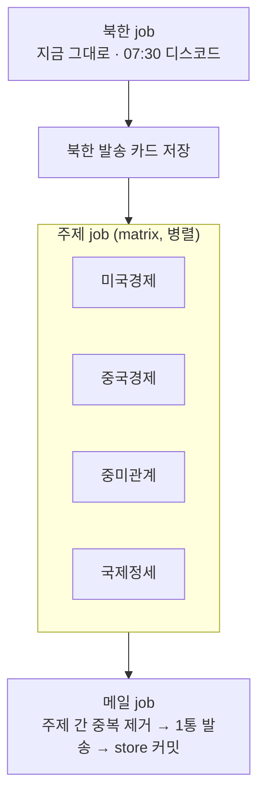

# 계획 — 이메일판 (북한 + 관심 주제 묶음)

- **상태**: 초안 (2026-09-15). 확인 전 구현 착수 안 함
- **한 줄 요약**: 디스코드는 지금 그대로 북한만. 같은 날 북한 카드 + 미국 경제·중국 경제·중미관계·국제정세 카드 + 영미권·중국 보도 비교를 메일 한 통으로 받는다

## 1. 목표와 범위

| 구분 | 내용 |
|---|---|
| 디스코드 | 지금 북한 브리핑 그대로. 동작·시각·원장 규칙 안 바뀜 |
| 이메일 | 하루 한 통. 북한 칸 + 새 주제 4칸 + 비교 칸 |
| 이메일 북한 칸 | 그날 디스코드로 나간 카드와 똑같은 카드 (다시 뽑지 않음) |
| 새 주제 | 미국 경제 · 중국 경제 · 중미관계 · 국제정세(영미권 매체만) |
| 비교 칸 | "같은 사건, 다른 시선". 국제 사건 전체에서 하루 1~2건 (4.9) |
| 주제별 독립 | 수집·선별·취재·검수는 주제마다 따로. 한 주제 실패가 다른 주제를 막지 않음 |
| 한꺼번에 | 발송만 모아서 1회 |

- **범위 밖**: 디스코드에 새 주제 싣기, 받는 사람 여러 명, 구독 관리

### 1.1 추가 요청 (2026-09-15, P0 도중)

- **국제정세 소스**: 한국어 매체 대신 영미권 매체
- **새 칸 후보 "같은 사건, 다른 시선"**: 같은 사건을 영미권과 중국 매체가 어떻게 다르게 전하는지 비교
- **가능성 측정 결과**: [P0-sources.md](P0-sources.md) 6·7절
- **정한 것**: 메일에 별도 칸, 하루 1~2건, 국제 사건 전체가 대상 → 4.9절

## 2. 용어

- **브리핑**: yaml 파일 하나 = 브리핑 하나 (`북한`, `미국경제` …)
- **토픽**: 지금 `audience.yaml`의 `토픽` 그대로. 브리핑 안의 카드 분류(군사·핵 등)
- **판(edition)**: 발송 단위. `디스코드판` = 북한, `메일판` = 북한 + 4개

## 3. 지금 구조에서 막히는 곳

| 막히는 곳 | 위치 | 왜 문제인가 |
|---|---|---|
| 설정 1개 고정 | `graph.py:91` `load_cfg()`, `graph.py:104` `CFG = load_cfg()` | import 시점에 전역으로 굳음. 한 프로세스에 브리핑 1개 |
| 프롬프트 전역 | `graph.py:117` `CRITERIA`, `graph.py:118` `SYS_DRAFT` | "북한 뉴스 브리핑 기자" 고정 |
| 검수 문구 | `graph.py:138` | "북한 매체의 주장" 고정 |
| 소스 목록 | `collect_nk.py:14` `SOURCES`, `:31` `NK_KEYWORDS` | 코드에 박힘 |
| 심층·언어 | `graph.py:46` `WEEKLY`, `graph.py:436` `SOURCE_LANG` | 소스 이름으로 박힘 |
| 1차 칸 | `graph.py:206` `fetch_tier1` | 통일부 전용 |
| 원장·기록 | `min_publish.py:20` `LEDGER`, `collect_nk.py:8-9` | `store/` 한 벌 |
| 하루 한 번 판정 | `run.py:32` `sent_today` | 디스코드 발송 1종만 봄 |
| 발행 | `graph.py:637` `publish` | 디스코드 전송이 그래프 안에 있음 |

## 4. 설계

### 4.1 설정 — `briefings/*.yaml`

- **북한**: `audience.yaml` 그대로 두고 소스·역할만 새 칸으로 옮김 (파일 이동은 마지막 단계에서 결정)
- **새 주제**: `briefings/미국경제.yaml` 식으로 1개씩
- **검증**: 지금처럼 pydantic `extra="forbid"`. 오타면 실행 전에 멈춤

```yaml
# briefings/중미관계.yaml (모양 예시, 값은 P0 측정 뒤 채움)
이름: "중미관계"
순서: 3                 # 메일 칸 순서이자 주제 간 중복 때 우선순위
카드: 3
기자역할: "미·중 관계 브리핑 기자"
독자:
  누구: "..."
  이미_아는_것: "..."
중요도_기준: ["..."]
버릴_것: ["..."]
토픽:
  - {이름: "무역·관세", 데스크지침: "...", 색: "#..."}
소스:
  - {이름: "...", 주소: "https://.../rss", 칸: 속보, 매일기대: true, 언어: 영어}
  - {이름: "...", 주소: "...", 칸: 심층, 매일기대: false, 언어: 영어, 키워드: ["China", "U.S."]}
원문_주장_주의: "중국 관영매체·백악관 발표를 사실로 단정하지 말 것"   # SYS_CHECK에 들어갈 브리핑별 문장
```

### 4.2 코드 구조

- **`graph.py`**: 전역 `CFG`를 없애고 `build(cfg)`로 받음
  - `SOURCES`·`WEEKLY`·`SOURCE_LANG`·`NK_KEYWORDS`는 cfg의 `소스`에서 만듦
  - `SYS_DRAFT`·`SYS_CHECK`·`CRITERIA`는 cfg로 조립
  - 1차 칸은 `1차: 통일부`가 있는 브리핑만
- **그래프 끝을 둘로 나눔**
  - `verify` 뒤 `fit_brief`까지 = 공통 → **카드 묶음** 산출
  - 북한: 지금 `publish`(디스코드) 그대로 이어 붙임
  - 새 주제: 디스코드 없음. 카드 묶음(예비 포함)만 저장
- **새 파일 `mail.py`**: 카드 묶음들을 모아 메일 1통 조립·발송
- **`run.py`**: `--briefing <이름>` 추가. 인자 없으면 지금과 똑같이 북한 디스코드판

### 4.3 흐름



- **시각**: 북한 job 끝(약 07:32) → 주제 job 병렬(예상 10~15분, P2에서 측정) → 메일 약 07:50 (추정)
- **주제 job은 북한 job을 기다리기만 함**: `needs: publish` + `if: always()`. 북한이 실패해도 돎
- **대기 비용 없음**: 07:30까지 자는 건 북한 job 하나뿐

### 4.4 저장 파일

| 파일 | 누가 씀 | 내용 |
|---|---|---|
| `store/published.json` 등 기존 파일 | 북한 job | 안 바뀜 |
| `store/cards/북한-YYYY-MM-DD.json` | 북한 job | 디스코드로 실제 나간 카드 (신규) |
| `store/briefings/<이름>/published.json` | 메일 job | 주제별 원장. 메일 발송 뒤에만 기록 |
| `store/briefings/<이름>/last_seen.json` | 메일 job | 주제별 GAP 기준 |
| `store/briefings/<이름>/metrics.jsonl` | 메일 job | 주제별 실행 행 |
| `store/mail.jsonl` | 메일 job | 메일 발송 행 (하루 한 번 판정용) |

- **카드 파일에 본문 안 넣음**: 지금 초안 dict에 `body[:6000]`가 붙어 있음. 공개 저장소라 저장 전에 뺀다 (`exp/bodies.json`을 뺀 이유와 같음)
- **커밋 충돌 방지**: 북한 job과 메일 job이 쓰는 파일이 겹치지 않게 나눔. `metrics.jsonl`을 같이 쓰면 두 job의 끝줄 추가가 rebase에서 충돌함

### 4.5 주제 간 중복

- **문제**: 중미관계 ↔ 국제정세 ↔ 경제 두 칸, 북한 ↔ 국제정세가 같은 기사를 뽑을 수 있음
- **처리 위치**: 메일 job (모든 카드가 모인 뒤)
- **순서**
  1. `link_key` 같은 카드 → `순서`가 뒤인 브리핑에서 뺌
  2. 전체 헤드라인을 `find_dupes`에 한 번 넘겨 같은 사건 묶음 → 같은 규칙으로 뺌
  3. 빠진 칸은 그 브리핑의 예비 카드로 채움 (지금 `TARGET = BRIEF_SIZE + 1` 예비 구조 재사용)
- **빠진 카드의 원장**: 그 브리핑 원장에도 기록 (지금 `twins` 규칙과 같은 이유 — 안 쓰면 내일 새 기사로 다시 올라옴)
- **북한 칸은 안 건드림**: 디스코드와 같아야 하므로 늘 1순위

### 4.6 메일 발송

- **방식**: Gmail SMTP + 앱 비밀번호. 파이썬 표준 `smtplib`·`email` → 새 의존성 없음
- **형식**: HTML + 평문 대체본 (multipart/alternative)
- **Secrets (사용자가 직접 등록)**: `MAIL_USER` · `MAIL_APP_PASSWORD` · `MAIL_TO`
  - 받는 주소는 저장소에 안 적음 (공개 저장소)
  - 앱 비밀번호는 Google 계정 2단계 인증이 켜져 있어야 발급됨
- **제목**: `북한·국제 브리핑 YYYY-MM-DD`
- **본문 순서**: 리드 → 북한 → 미국 경제 → 중국 경제 → 중미관계 → 국제정세 (`순서` 칸으로 바꿀 수 있음)
- **카드 1장**: 칸 라벨 · 헤드라인 · 요약 · 💡 왜 중요한지 · 출처·토픽·시각 · 원문 링크

### 4.7 실패·재발송 규칙

| 상황 | 메일에 보이는 것 | 원장 |
|---|---|---|
| 한 주제 job 실패 | 그 칸에 "⚠️ 수집 실패로 이 칸을 만들지 못했습니다" | 그 주제 기록 없음 |
| 주제 정상, 기사 0건 | "오늘은 실을 기사가 없습니다" | 없음 |
| 북한 디스코드 실패 | 북한 칸에 실패 안내 | 북한 원장 규칙 그대로 |
| 모든 칸 실패 | 메일 안 보냄 + job 실패(빨강) | 없음 |
| SMTP 오류 | 안 보냄 + job 실패 → 08:13 예비 실행이 재시도 | 없음 |
| SMTP 응답 끊김(보냈는지 모름) | — | 보낸 것으로 기록 (지금 디스코드 `"unknown"` 규칙과 같음: 중복보다 누락이 낫다) |
| 08:13 예비 실행 | 메일 이미 보냈으면 주제·메일 job 건너뜀 | — |

- **빈 결과를 조용한 날로 읽지 않음**: 이 저장소 규칙 그대로. 실패와 0건을 메일에서 구분해 보여줌

### 4.8 Actions

- **`daily.yml`에 job 2개 추가**: `topics`(matrix) · `mail`
- **기존 `publish` job**: 카드 저장 1단계만 추가. 기록 커밋 규칙(`!cancelled()`) 안 건드림
- **`topics`**: 커밋 안 함. 카드 묶음과 주제 state를 artifact로 넘김
- **`mail`**: artifact 받아 발송 → `store/briefings/**`·`store/mail.jsonl` 커밋 (기존 rebase 3회 재시도 재사용)
- **concurrency**: 같은 `briefing` 그룹 안의 job이라 추가 설정 없음

### 4.9 비교 칸 — "같은 사건, 다른 시선"

- **정한 것 (2026-09-15)**: 메일에 별도 칸 · 하루 1~2건 · 국제 사건 전체
- **실행 단위**: 브리핑 yaml 하나(`briefings/비교.yaml`)로 둠. 주제 job matrix에 한 줄 추가
  - 영미권 풀: 국제정세 소스 그대로 재사용
  - 중국 풀: CGTN World·China·Politics, 중국신문망 국제·요문
- **흐름**
  1. 짝 찾기: 중국 기사마다 영미권 제목 목록에서 후보 최대 3개 제안
  2. 1:1 확인: 두 기사에 모두 적힌 사실(누가·무엇을·언제)을 대야 통과
  3. 고르기: 짝이 있는 사건 중 영미권 매체 수가 많은 순. 기사 유형(현장 기사 ↔ 대변인 발언 요약)이 비슷한 쌍 우선
  4. 비교문 쓰기: 차이 2~3개. 지점마다 양쪽 원문 구절 그대로 + 한국어 설명 한 문장
  5. 검수 (아래)
- **검수 — 셋 다 통과해야 실림**
  - 코드: 인용 구절이 각 원문에 실제로 있나 (없는 지점은 빼고, 2개 미만 남으면 탈락)
  - 모델: 비교 단계에서도 같은 사건이라고 답했나 (측정: 아니라고 답하면서 비교문을 쓴 사례 있음)
  - 모델: 설명 문장이 두 인용에서 나오나, 어느 쪽이 옳다고 판정하지 않았나
- **카드 모양**
  - 사건 한 줄
  - 영미권: 매체 이름들 · 요점 한 줄
  - 중국 매체: 매체 이름(관영 표시) · 요점 한 줄
  - 차이 2~3개: 항목 · 영미권 인용 · 중국 인용 · 설명
  - 원문 링크 양쪽
- **원장**: 비교 칸 전용. 실린 사건의 양쪽 링크를 기록해 다음 날 같은 쌍을 다시 안 씀
- **주제 간 중복 (기본값, 7절)**: 비교 칸은 국제정세 카드와 같은 사건이어도 뺌 없이 둠 (역할이 다름). 카드 제목 옆에 "비교 칸 참고" 표시만
- **0건인 날**: "오늘은 양쪽이 함께 다룬 사건 중 비교할 만한 것이 없습니다". 짝 찾기 실패(수집 실패)와 구분해 표시

## 5. 단계

### P0. 소스 후보 측정 (코드 변경 없음)

- **상태**: 로컬 측정 끝 (2026-09-15). 결과 [P0-sources.md](P0-sources.md). 러너 재측정 남음

- **후보 찾기**: 주제별 RSS 후보 5~8곳
  - 한국어: 연합뉴스 경제·국제 RSS 등
  - 영어: 공개 RSS가 있는 경제·국제 매체, 1차 자료(미 연준·BLS 발표 RSS 등)
  - 중국 쪽: 영문 중국 경제 매체, 관영매체 영문판 (주장 주의 대상)
- **측정 기준 (지금 게이트 재사용)**
  - G1 원문 추출: `requests`+UA, 본문 600자 이상, 유료벽 티저 판별 (`test_g1.py`·`test_g1_paywall.py`)
  - G2 발행량: 14일 집계 (`test_g2.py`)
  - G3 robots.txt: 상태코드부터 확인 (`test_g23.py`)
  - 러너 접근: 로컬 200 ≠ 러너 200. 채택 후보만 임시 브랜치에서 러너로 재측정
  - 주제 적합도: 72h 기사 중 그 주제 기준에 걸리는 비율 (`probe_sources.py`의 판정 방식)
- **측정 기록 주의**: 측정 스크립트가 `store/metrics.jsonl`에 행을 덧붙임 → 새 주제 측정은 별도 파일로
- **산출**: 주제별 채택·보류 표 → 확인받고 yaml에 반영
- **완료 기준**: 주제마다 속보 소스 2곳 이상이 G1·G2·G3 통과

### P1. 그래프를 설정 주입형으로 (북한 동작 불변)

- **할 일**: 4.2의 리팩터링. 북한 설정은 지금 값을 그대로 옮김
- **완료 기준**
  - `test_graph_fake.py` 19개 · `test_grounding.py` · `test_schedule.py` · `test_config.py` 전부 통과
  - 같은 가짜 입력에서 리팩터 전후 디스코드 payload가 글자 단위로 같음 (비교 테스트 신규)
  - `python run.py` 인자 없이 = 지금과 같은 로그 모양

### P2. 새 주제 1개 끝까지 (dry-run)

- **대상**: 중미관계 (소스가 가장 먼저 확정되는 주제로 바꿀 수 있음)
- **확인할 것**: 카드 품질, 숫자 검수(`grounding.py`가 영문·경제 숫자에서 오판하는지), 실행 시간, 모델 호출 수
- **완료 기준**: dry-run 3회, 카드 검수 로그 사람이 읽고 통과

### P3. 메일 조립·발송

- **할 일**: `mail.py`, 주제 간 중복, 실패 칸 표시, `store/mail.jsonl`
- **테스트 (키·네트워크 없이)**: 중복 제거 · 예비 채움 · 실패 칸 · 하루 한 번 판정 · SMTP 가짜 서버(오류·응답 끊김)
- **실발송 1회**: Secrets 등록 뒤 사용자 확인 받고 본인 주소로
- **완료 기준**: 받은 메일을 Gmail 웹·모바일에서 눈으로 확인

### P4. 나머지 주제 3개

- 미국 경제 · 중국 경제 · 국제정세 yaml 작성
- 주제별 dry-run 각 2회 + 주제 간 중복이 실제로 걸리는지 확인

### P4b. 비교 칸

- **할 일**: 4.9의 짝 찾기·비교문·검수, `probe_compare.py`의 판정을 파이프라인 코드로 옮김
- **테스트 (키 없이)**: 인용 대조(있음·없음·따옴표·공백 차이) · 같은 사건 아님 응답 탈락 · 0건 날 표시
- **측정 (키 필요)**
  - 판다 같은 가짜 짝 카나리아를 매 실행 1건 섞어 걸러지는지
  - dry-run 5일치 비교문을 사람이 읽고 "형식 차이를 시각 차이로 쓴 지점" 수 세기
- **완료 기준**: 5일 중 4일 이상 1건 이상 실리고, 사람이 읽어 틀린 짝 0건

### P5. Actions 연결·운영

- `daily.yml` job 추가 → 임시 브랜치에서 `workflow_dispatch` dry-run
- 첫 예약 실행 다음 날 확인 목록: 디스코드 시각 불변 · 메일 도착 시각 · 08:13 건너뜀 · 커밋 2개 충돌 없음
- `scorecard.py` 브리핑별 보기
- README·HANDOFF 갱신

## 6. 비용·시간 (추정, P2에서 실측으로 교체)

- **모델 호출**: 브리핑 1개당 대략 선별 2 + 중복 확인 1~3 + 카드마다 초안 1·검수 1 (+재작성)
  - 주제 4개 추가 → 하루 호출 약 5배 (추정)
  - 메일 job 주제 간 중복 확인 +1
- **Actions 시간**: 공개 저장소라 러너 분 과금 없음
- **최근 북한 실행 시간**: 36.4초 (`store/metrics.jsonl` 마지막 행, 2026-09-15 12:34 로컬 dry-run)

## 7. 정해야 할 것 (괄호는 기본값)

- 새 주제 카드 수 (주제당 3장)
- 메일 도착 시각 (북한 디스코드 직후, 약 07:50)
- 주제 순서 = 중복 우선순위 (북한 → 미국경제 → 중국경제 → 중미관계 → 국제정세)
- 국제정세에서 북한 기사 허용 여부 (북한 칸과 중복이면 뺌)
- 받는 주소 (Secret `MAIL_TO`에 직접 등록)
- 비교 칸 위치 (국제정세 칸 바로 뒤)
- 비교 칸과 국제정세 카드가 같은 사건일 때 (둘 다 싣고 "비교 칸 참고" 표시)
- 중국신문망 피드 창 12~14시간 대응 (CGTN 중심으로 시작, 필요하면 하루 두 번 수집)

## 8. 위험

- **P1 리팩터가 매일 나가는 디스코드를 깸** → payload 동일성 테스트 + 임시 브랜치 dry-run 전에는 main에 안 올림
- **경제 기사 숫자 검수 오판**: `grounding.py`는 북한 원문으로 다듬음. 환율·%p·bp 표기에서 새 오판 가능 → P2에서 사례 수집
- **영문 유료벽**: 경제 매체 다수가 티저만 줌 → G1 유료벽 판별 필수
- **관영매체 주장**: 중국 경제 칸에서 신화·CGTN 발표를 사실로 단정할 위험 → yaml `원문_주장_주의` + 검수 문구
- **Gmail 스팸함**: 자기 자신에게 보내는 SMTP라 대체로 받은편지함이지만 첫 발송에서 확인
- **비교 칸 틀린 짝**: 측정에서 1:1 확인 뒤에도 15건 중 2건이 틀림 → 공통 사실에 누가·무엇을·언제를 요구 + 카나리아
- **형식 차이를 시각 차이로 씀**: 현장 기사와 대변인 발언 요약을 비교하면 차이가 형식에서 나옴 → 유형이 비슷한 쌍 우선, 사람 검토 5일
- **사소한 차이**: "opposition ↔ opposition bloc" 같은 지점이 뽑힘 → 비교문 지시에 "뜻이 달라지는 차이만" + 검수 항목
